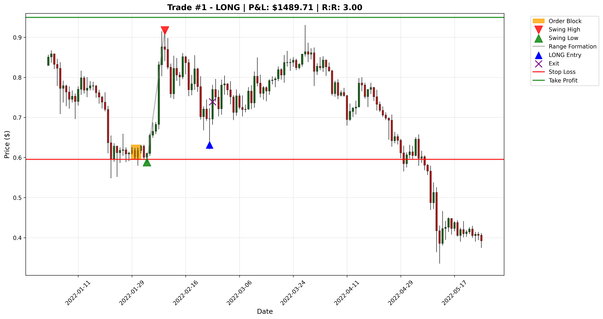
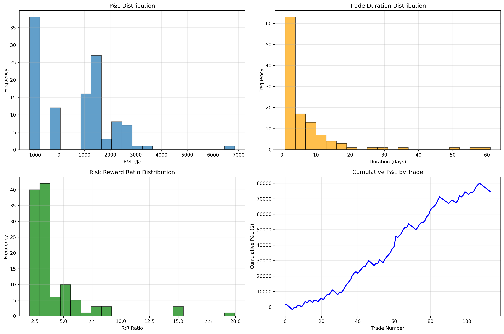
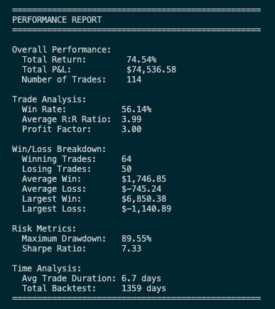

# Trend Following Trading Strategy

A retracement-based trading strategy that identifies swing points and uses order blocks to enter positions during pullbacks.

## Strategy Overview

This strategy operates on the principle of trading retracements within established ranges:

1. **Swing Detection**: Identifies swing highs and lows using a 3-candle pattern
2. **Range Formation**: Creates trading ranges between swing highs and lows
3. **Order Block Identification**: Finds order blocks (candles before swing points) as entry zones
4. **Retracement Entries**: Enters positions when price retraces to order blocks within valid ranges

### Entry Logic

**Long Entries:**
- Price must retrace to within the order block range (between order block low and high)
- Entry price: Top of the order block
- Stop loss: Bottom of the order block
- The swing low must remain unbreached

**Short Entries:**
- Price must retrace to within the order block range (between order block low and high)
- Entry price: Bottom of the order block
- Stop loss: Top of the order block
- The swing high must remain unbreached

### Range Validation

Ranges must meet several criteria to be valid:
- Minimum width of 5% (configurable via `MIN_RANGE_WIDTH`)
- Order block must be completely contained within the range
- Order block size cannot exceed 1/3 of the range size
- Range must show liquidity break (swing high breaks above previous high for longs, swing low breaks below previous low for shorts)
- Range becomes invalid if key swing levels are broken

## Configuration

All strategy parameters are configured in `config.py`:

### Core Parameters
- `SWING_PERIOD`: Number of candles for swing detection (default: 3)
- `MIN_RR_RATIO`: Minimum risk-reward ratio (default: 2.0)
- `MIN_RANGE_WIDTH`: Minimum range width as percentage (default: 0.05)
- `RISK_PERCENT`: Risk per trade as percentage of account (default: 0.01)

### Partial Exits
- `PARTIAL_EXIT_RR`: R:R ratio for taking partial profits (set to None to disable)

### Data Configuration
- `DATA_PATH`: Path to CSV data file
- `START_DATE` / `END_DATE`: Backtest date range

### Visualization
- `GENERATE_CHARTS`: Enable/disable chart generation (default: True)

## Project Structure

```
trend-following/
├── config.py                 # Strategy configuration
├── main.py                   # Main backtest execution
├── data/                     # Market data files
├── strategy/
│   ├── swing_detector.py     # Swing point detection
│   ├── signal_generator.py   # Entry/exit signal logic
│   ├── range_manager.py      # Trading range management
│   └── order_blocks.py       # Order block detection
├── backtesting/
│   ├── backtest_engine.py    # Event-driven backtest engine
│   └── portfolio.py          # Portfolio management
├── visualization/
│   └── charts.py             # Trade chart generation
└── data/
    └── data_processor.py     # Data loading and validation
```

## Usage

### Running a Backtest

```bash
python main.py
```

### Configuration Examples

**Disable chart generation for faster backtests:**
```python
GENERATE_CHARTS = False
```

**Change partial exit level:**
```python
PARTIAL_EXIT_RR = 3.0  # Take half position at 3:1 R:R
```

**Disable partial exits:**
```python
PARTIAL_EXIT_RR = None
```

**Test different instruments:**
```python
DATA_PATH = os.path.join(os.path.dirname(__file__), 'data', 'btc-usd-coinbase-weekly.csv')
```

## Output

The backtest generates several types of output files when completed:

### 1. Individual Trade Charts (`trade_X_chart.png`)

When `GENERATE_CHARTS = True`, the system generates detailed charts for each trade showing:

- **Price Action**: OHLC candlestick data spanning 90+ days around the trade
- **Swing Points**: Red triangles (▼) for swing highs, green triangles (▲) for swing lows
- **Order Block**: Orange/yellow rectangle showing the entry zone
- **Range Lines**: Horizontal lines connecting the swing high and low that formed the trading range
- **Entry Point**: Blue triangle (▲ for long, ▼ for short) marking the exact entry
- **Stop Loss**: Red line showing the stop loss level
- **Take Profit**: Green line showing the take profit target
- **Exit Point**: Red X marking where the trade was closed



Each chart title shows:
- Trade number and direction (LONG/SHORT)
- P&L result
- Risk-reward ratio achieved

### 2. Trade Analysis Summary (`trade_analysis.png`)

A comprehensive performance dashboard showing:
- **Equity Curve**: Portfolio value over time
- **Monthly Returns**: Heatmap of returns by month/year
- **Trade Statistics**: Win rate, average R:R, total return, max drawdown
- **Return Distribution**: Histogram of individual trade returns
- **Drawdown Analysis**: Underwater curve showing portfolio drawdowns



### 3. Trade Log (`trade_log.csv`)

A detailed CSV file containing every trade with columns:
- Entry/exit dates and prices
- Trade type (LONG/SHORT)
- P&L and R:R ratio
- Duration in days
- Exit reason (stop_loss, take_profit, partial_exit)
- Swing point data (prices and indices)

### 4. Console Output

Real-time logging during backtest execution showing:
- Range validation details
- Entry/exit triggers with exact prices and timing
- Trade performance as they complete
- Final summary statistics



The console provides detailed logging such as:
```
LONG range VALIDATED: Current swing high $245.67 broke above previous high $234.12
LONG ENTRY TRIGGER: Current low $156.78 within order block $155.00-$162.50
Entry: long at $162.50 on 2023-03-15
Exit: take_profit at $245.67 on 2023-04-02, P&L: $1,247.89
```

## Risk Management

- **Position Sizing**: Risk-based position sizing (1% account risk per trade by default)
- **Stop Losses**: Always placed at order block boundaries
- **Partial Exits**: Optional partial profit taking at configurable R:R levels
- **Range Invalidation**: Automatic position closure if key swing levels are broken

## Data Requirements

CSV files with columns:
- `datetime`: Timestamp
- `open`: Open price
- `high`: High price
- `low`: Low price
- `close`: Close price

## Dependencies

- numpy
- pandas
- matplotlib (for chart generation)
- datetime